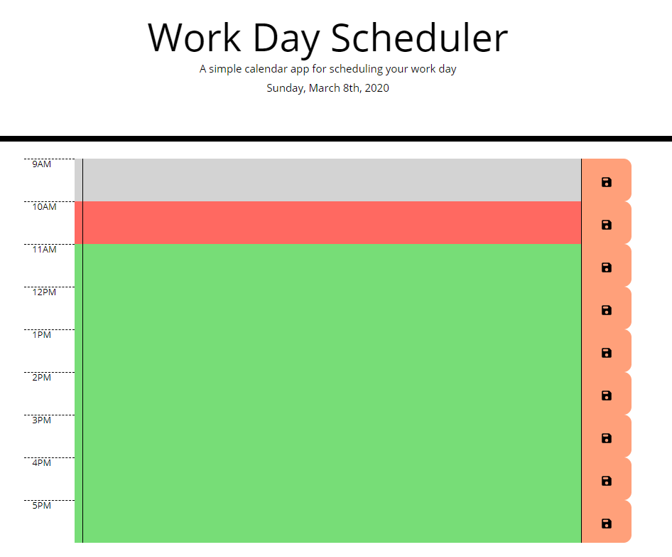
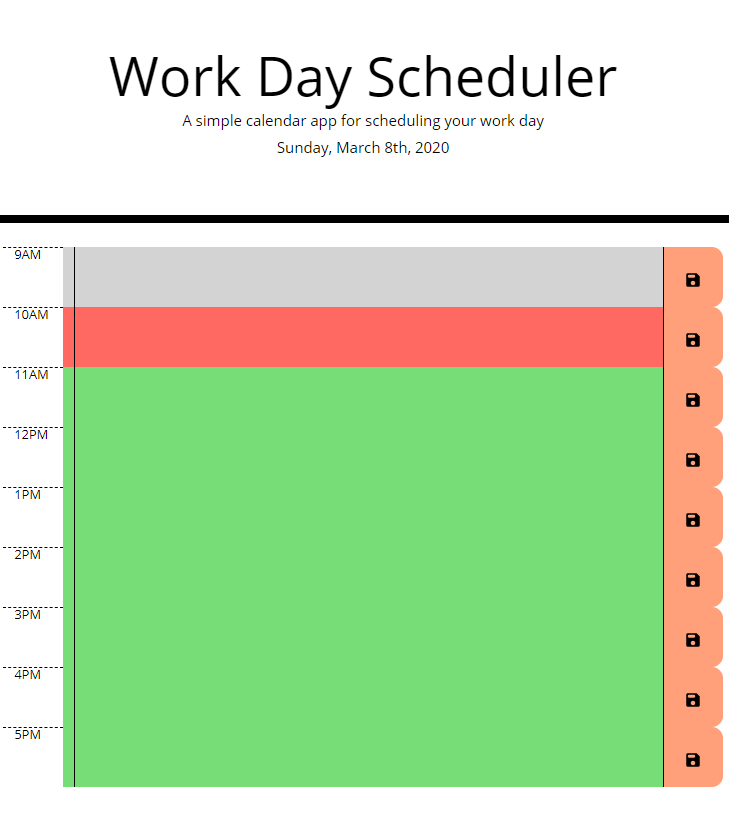

# Work Day Scheduler

https://khny258.github.io/Work-Day-Scheduler/

<strong>Desktop</strong>
 

<strong>Mobile</strong>
 

 

<strong>What The Application Should Look Like</strong>
 
 

 

# What I Did
I created a daily planner using HTML, CSS, JavaScript, jQuery, & AJAX - Moment.js library that:
- Shows the current date at the top of the calendar
- Color coded the timeblocks (gray - past, red - present, green - future)
- Saves information into local storage
- Refresh the page and the events are still there
